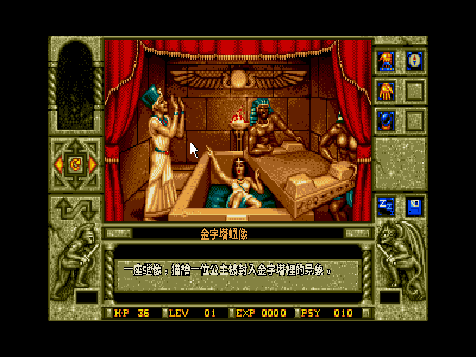
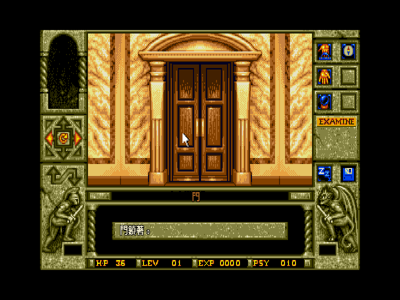
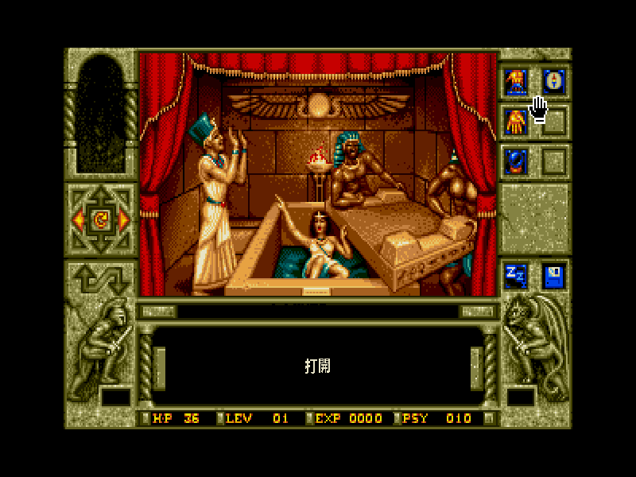
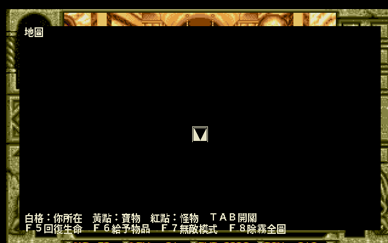
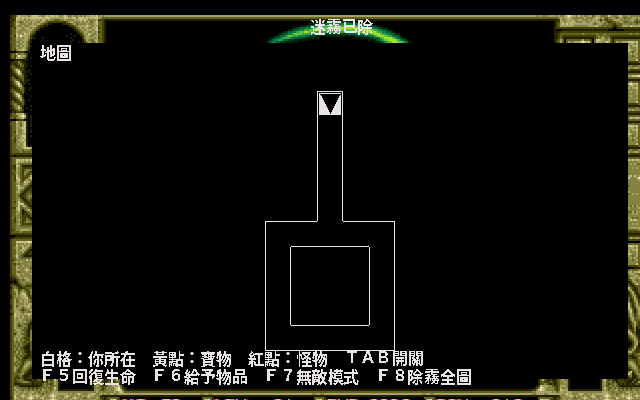

# 蠟像館之謎 — Waxworks 繁體中文化（DOS Floppy / ScummVM AGOS）

> 1992 年 Horrorsoft 出品、Accolade 發行的第一人稱恐怖冒險。三十四年後，它第一次開口說中文。



---

## 一封遲到三十四年的信

還記得嗎？那個沒有 GameFAQ、沒有 Discord、沒有 wiki 的年代。你在光華商場的角落翻到一盒封面印著猙獰蠟像的洋遊戲，抱回家插進 386，看著螢幕上一座座蠟像亮起——古埃及、開膛手傑克、食人礦坑、月光下的墓園——然後你意識到一件事：**你一個字都看不懂。**

2009 年，一位叫 icecap 的玩家在痞客邦寫下這段話：

> 「只是當時除了遊戲中四個蠟像陳列室的名牌外，沒有東西可以告訴我故事的來龍去脈……原文寫得很像小說，還結合了部分歷史，讀起來很有趣，就把它翻了出來。」

他當年沒有中文版，於是**自己動手把整本英文手冊翻成中文**。這個 repo，就是那份心願遲到三十四年的回答——這一次，連遊戲裡的每一句對白、每一個物件、每一段敘述，都說中文了。

這份中文化不改一張遊戲原圖、不動一個位元組的遊戲檔——它是一份給 ScummVM 引擎的補丁，讓引擎在你玩的當下，把英文換成繁體中文。你需要自備一份合法的 Waxworks 遊戲檔（見下方〈怎麼玩〉）。

---

## 目錄
- [四座蠟像，四種死法](#four-waxworks)
- [譯名對照](#glossary)
- [怎麼玩](#how-to-play)
- [技術深潛：AGOS 引擎的繁中化為什麼不能「零 patch」](#tech)
- [檔案結構](#files)
- [我們把「勸退神作」變得可愛了（動態地圖・除霧全圖・給予物品・噴火槍無限・無敵模式）](#roadmap)
- [致謝](#credits)

---

<a name="four-waxworks"></a>
## 🕯️ 四座蠟像，四種死法

你繼承了叔叔鮑里斯的蠟像館。他留下一句話、一顆水晶球，和四座**會把你吸進去的**蠟像。每一座通往一個時代，每個時代都躺著一位被詛咒的邪惡祖先——你的雙胞胎兄弟即將變成的樣子。進去，殺掉他，或者被他殺掉。

Waxworks 以血腥著稱。當年巴哈的玩家 tsuchung 就說：「以現在的分類應該算十八禁了吧。」角色死亡時會給你一張**屍體特寫**。你會死很多次。

### ① 古埃及金字塔　｜　BOSS：阿努比斯大祭司
六層金字塔，滾石、絆線、毒蛇。最折磨人的是那些謎題：五條直線加總必須相等的**天平配重數字謎**、得先灌滿聖甲蟲瓶才能過的水流機關、對應古壁畫符號的瓷磚。最經典的一幕——**用調諧音叉共振震碎整面玻璃牆**。蛇群追來時，你只有一把油火。

### ② 維多利亞倫敦・白教堂區　｜　BOSS：開膛手傑克
霧夜的倫敦東區，你在追一個連續殺人魔——而街坊都覺得**你**才是兇手。你得**用鉛筆在妓女的日記上拓出隱形字**、偽裝成紳士混進黑公牛酒館、用安眠藥毒昏看門狗。最後在屋頂跨樓逃亡，然後與傑克拔出紳士劍杖，貼身肉搏。抓到破綻就別停手。

### ③ 變種植物礦坑　｜　BOSS：邪魔
毒氣瀰漫，活體藤蔓從黑暗裡抽出來抓你。你的主武器是一把**只能用 12 次**的化學噴槍——每一發都要算。你得自製防毒面具（手帕＋木炭）、用焊槍切斷牢房鎖鏈救出爆破工和醫生、精準鑽孔埋下炸藥。對付那頭盤在腐屍堆裡的巨型植物怪，先拿鐵棒**戳牠的眼睛**。

### ④ 墓園・外西凡尼亞　｜　BOSS：吸血鬼弗拉迪米爾
殭屍成群，而且**你砍牠們的頭沒用**——得先打斷四肢，再斬首。你深入祖先的陵墓，找少女之心與麵包當解咒材料，避開設了陷阱的棺材。最後在月光教堂裡，與吸血鬼對決——手上握著一根**木樁**。

---

<a name="glossary"></a>
## 📖 譯名對照

人名一律音譯、地名與怪物沿用華語固定譯法，標題採華語圈通行的《蠟像館之謎》（巴哈 2005、痞客邦 2009、bilibili 三個獨立出處一致）。

| 英文 | 繁中 | 說明 |
|---|---|---|
| Waxworks | 蠟像館之謎 | 通行譯名 |
| Uncle Boris | 鮑里斯叔叔 | 水晶球指引的亡叔 |
| Alex | 亞力克斯 | 主角的雙胞胎兄弟 |
| Ixona | 伊索娜 | 遠古巫女，下咒者，最終 BOSS |
| Anubis | 阿努比斯 | 埃及死神 |
| High Priest | 大祭司 | 埃及場 BOSS |
| Jack the Ripper | 開膛手傑克 | 倫敦場 BOSS |
| Whitechapel | 白教堂區 | 傑克犯案的倫敦東區 |
| Vladimir | 弗拉迪米爾 | 墓園場吸血鬼 BOSS |
| The Evil One | 邪魔 | 礦坑場 BOSS |
| Hathor | 哈托爾 | 埃及生命女神 |
| psychic energy | 心靈力 | 用來聯繫叔叔求提示 |

完整譯名表與翻譯處理原則（招牌保留原文、蛇嘶聲創譯、底層口音鄉土化等）見 [`translations/glossary.md`](translations/glossary.md)。

---

<a name="how-to-play"></a>
## 🎮 怎麼玩

**你需要一份合法的《Waxworks》(Floppy DOS, 英文版) 遊戲檔。**本 repo 不含、也不會提供遊戲本體（版權素材）。

### 方式 A：一鍵完整版（自己有遊戲檔者，最省事）
用本 repo 的腳本把「patched ScummVM + 中文資產 + 你的遊戲檔」打成單一 AppImage：
```bash
# 把遊戲檔放進 run_game/，然後：
bash scripts/build_scummvm.sh      # 編 patched ScummVM(docker)
bash scripts/build_font.sh          # 烘 Big5 字型
python3 tools/build_translation.py translations/zh.tsv fonts/waxworks_zh.tab
bash scripts/build_appimage.sh      # 產 dist-all/Waxworks-CHT-FULL-x86_64.AppImage
```
雙擊 AppImage 直接進中文遊戲。

### 方式 B：手動套用到自編 ScummVM
1. 取得 ScummVM **v2.9.1** 原始碼，套用 [`patches/agos-cht.patch`](patches/agos-cht.patch)：
   ```bash
   cd scummvm && git apply /path/to/agos-cht.patch && make
   ```
2. 把 `fonts/waxworks_zh16.dcjk`、`fonts/waxworks_zh24.dcjk`、`fonts/waxworks_zh.tab` 放進遊戲夾（與 `GAMEPC` 同目錄）。
3. 用這個 patched ScummVM 開遊戲即自動切繁體中文。**遊戲內按 F8 可切回英文。**

> 引擎偵測到遊戲夾裡有 `waxworks_zh16.dcjk` 就自動啟用繁中模式（640×400 高解析畫布 + Big5 渲染），並自動跳過防拷（原版開場要對三層密碼轉盤，繁中版免）。

---

<a name="tech"></a>
## 🔧 技術深潛：AGOS 引擎的繁中化為什麼不能「零 patch」

很多 SCUMM 老遊戲（猴島、印第安那瓊斯）可以「零 patch」中文化——丟一個字型檔進遊戲夾，官方 ScummVM 偵測到就自動切 CJK。**Waxworks 不行**，因為它跑的是另一套引擎：**AGOS**（Adventure Game OS，Horrorsoft 的 Simon the Sorcerer / Elvira 系列引擎）。AGOS 沒有 CJK 渲染路徑，所以必須改引擎原始碼。這份補丁做了這些事：

**① 字串注入（唯一咽喉：`getStringPtrByID`）**
Waxworks 所有對白、敘述、物件名都經過 `string.cpp` 的 `getStringPtrByID(stringId)`。補丁在這個出口依 `stringId` 查繁中譯表（`waxworks_zh.tab`），命中就回傳 Big5 字串。一個攔截點覆蓋全部劇情文字。

**② 高解析雙層畫布（沿用 PC98 基礎建設）**
AGOS 原生是 320×200、6×8 英文點陣字，塞不下中文。補丁**沿用引擎原本給日文 PC98 版的 dual-layer 機制**：邏輯層 `_backBuf`（320×200，原畫照畫）+ 高解析疊層 `_scaleBuf`（640×400）。中文字用 16×16 點陣畫進疊層 → 原生銳利、相對變小、不擠版。原版美術用 nearest 放大保持像素感。只要把引擎既有的 `ELVIRA1 && PC98` 條件 OR 上一個 `_chtHires` 旗標，游標 2×、滑鼠座標還原全都白撿。

**③ Big5 繪字 + 描邊 + 亮度守門**
`windowPutChar` 偵測 Big5 雙位元組（lead 0x81–0xFE），把中文字繪進 `_scaleBuf`，帶 1px 描邊（壓在花紋美術上也有輪廓），並用 BT.601 亮度守門：只在字色暗到讀不到時才換色，其餘保留原本配色。

**④ 換行不靠空白（AGOS 的一個大坑）**
AGOS 的對白框排版函式 `checkFit` 靠**空白斷詞**換行——但中文沒有空白，會讓指標變成 `nullptr` 直接崩潰。補丁讓繁中模式改用「依視窗欄寬折行」，並重寫 `getBoxSize` 依 CJK 格數決定對話框大小，繞過會崩潰的 `checkFit`。

**⑤ 防拷自動過**
原版開場要對三層密碼轉盤輸入 4 位數，錯三次關遊戲。ScummVM 的 `_copyProtection=false` 會讓引擎在 `o_process` 跳過防拷 subroutine（id 71）。繁中模式強制關閉，玩家免查轉盤。

補丁共動 11 個引擎檔、約 590 行，全部集中在 `// 非上游` 標記的分支、用旗標 gate、不破壞英文與其他語言的原路徑。完整方法論見 [`docs/CLAUDE-AGOS.md`](docs/CLAUDE-AGOS.md)（一份可重用於任何 AGOS 遊戲的中文化模板）。



**⑥ verb 名中文化（overlay 蓋 VGA 美術）**
verb 名（EXAMINE 等）是**烘進 VGA 影像**的美術（zone 1 sprite 106–113，hover verb 時 `animate(2,1,IMG)` 顯示），不經文字系統。補丁的解法：利用 hi-res 疊層的合成規則「`v1 ? v1 : v0`（非零疊層蓋過底圖）」——在 verb 名的疊層區填入**取樣到的底色**蓋掉英文，再畫中文 verb 名（查看／拿取／打開／使用…）。`_windowArray[2]` 自動定位、選字典/對白時自動清除，不覆蓋劇情文字。



### 已知未竟（依「完整性優先」原則誠實列出，非略過）
- 片頭 credits 是預繪 VGA 點陣圖（美術），保留英文。
- 存讀檔部分 base 硬字串（Save failed 等）待補 ZH 分支（WW 覆寫確認走 script，已中文）。

---

<a name="files"></a>
## 📁 檔案結構（patch-only，不含遊戲本體）

```
patches/agos-cht.patch        # ScummVM AGOS 引擎繁中補丁(對 v2.9.1)
translations/zh.tsv           # id→繁中譯文(1585 條)
translations/glossary.md      # 統一譯名表 + 翻譯原則
fonts/waxworks_zh16.dcjk       # Big5 16×16 點陣字型(視窗文字，繁中開關)
fonts/waxworks_zh24.dcjk       # Big5 24×24 點陣字型
fonts/waxworks_zh.tab          # 編譯後的 Big5 譯表(STAB 格式)
tools/extract_floppy_text.py   # 抽字(GAMEPC 字串表 + TEXTxx 對白)
tools/build_cjk_font.py        # TTF → Big5 DCJK 點陣字型
tools/build_translation.py     # zh.tsv → STAB 二進位譯表
scripts/                       # docker 建置 / 打包 / headless 擷取
docs/CLAUDE-AGOS.md            # AGOS 引擎中文化通用方法論模板
docs/RESEARCH.md               # 遊戲研究(譯名/攻略/防拷/情感鉤子)
```

**遊戲原檔（`GAMEPC`/`TEXTxx`/`*.VGA` 等）、ROM、含版權配樂的影片一律不入此 repo。**

---

<a name="roadmap"></a>
## ✨ 我們把一款「勸退神作」變得可愛了

先說結論：**如果你這輩子只想好好玩一次 Waxworks，就是現在，就用這一版。**

Waxworks 是那種你會又愛又恨的遊戲。愛它——因為 1992 年就有人敢把古埃及、開膛手傑克、食人礦坑、吸血鬼墓園塞進**同一盒磁片**，每一段都是一部小型恐怖電影，每一個謎題都設計得像鐘錶一樣精密，血腥得讓當年的你邊玩邊回頭看房門有沒有關。恨它——因為它**沒有地圖**、怪物埋伏在每個轉角、死法多到可以出一本畫冊，而且當年**一個中文字都沒有**。多少人就是在第三次被同一頭木乃伊掐死、在同一條沒有地圖的墓道裡鬼打牆之後，默默把磁片收進抽屜，從此再沒打開。

**這一版，把「恨」的部分全部拿掉了，只留下「愛」。**

### 🗺️ 一按 `TAB`，迷宮再也困不住你



以前你要拿方格紙一格一格手繪地圖（沒錯，當年真的有人這樣做）。現在，在第一人稱迷宮裡隨時按一下 **`TAB`**——**你走過的每一格都會像探照燈一樣亮起來**：踏過的每一道牆、每一扇門、你此刻站在哪（白格裡還有一個**箭頭指出你正面對的方向**），還有**黃點標出寶物、紅點標出怪物**。沒走過的地方留在黑暗裡（探索迷霧），走到哪、地圖就長到哪。哪裡有埋伏、哪裡還沒探索、那把過關必備的鑰匙落在哪個房間，一目了然。再也不會在墓道裡轉到分不清東南西北。

這不是外掛截圖拼的假地圖——它是**引擎即時讀出**迷宮資料畫的：每個房間的牆與門編碼在 `roomExitStates` 裡，我們讓引擎從你腳下的房間一路 BFS 走出去、鋪成平面、把牆線和寶物怪物即時畫進高解析疊層。連「怪物是固定放置還是隨機生成」都逆向確認過了（固定的，所以標得準）。技術細節見 [`docs/DYNAMIC_MAP_FEASIBILITY.md`](docs/DYNAMIC_MAP_FEASIBILITY.md)。

### 🌫️ 嫌迷霧太慢？按 `F8`，整張地圖一次攤開



探索迷霧很有氣氛，但你今天只想直搗黃龍。按一下 **`F8`**，迷霧「唰」地散去——**從你腳下能走到的每一個房間、每一條走廊、每一扇門，全部一次現形**（右上角亮起「迷霧已除」）。哪條路通往寶物、哪個死角藏著怪物、出口到底在左邊還是右邊，全圖在握，一步不多走。想找回慢慢摸索的樂趣？再按一次就恢復。

### 🎁 卡在「就差一個道具」？按 `F6`，房裡的東西直接進背包

Waxworks 的謎題常常卡在一個不起眼的小物件上——一把鑰匙、一根火把、一瓶藥水，藏在你走過八百次卻沒 search 到的角落。按一下 **`F6`**，**當前房間裡所有能撿的東西，一鍵全塞進你的背包**（螢幕中央會告訴你「已拾取物品」，空房間則是「房內無物」）。不必再逐格 search、逐項 take，該拿的過關道具一次到手。

### 🔥 噴火槍打到手軟？現在**次數無限，永不耗盡**

礦坑那場硬仗，化學噴火槍是你對付食人藤與變種怪的命脈——偏偏它**用一次少一次**，打到一半沒油，只能眼睜睜被藤蔓絞死。這一版，只要開著無敵模式，**噴火槍（以及任何有使用次數的消耗武器）每一幀都幫你補到滿**：火焰噴不完、彈藥用不盡，盡情把擋路的東西通通燒乾淨。

### 🛡️ 想純看劇情？按 `F7`，從此不再死

Waxworks 最出名的就是它**花式到不行的死法**——被斬首、被開膛、被藤蔓絞成兩截、被木乃伊活活掐死，每次都配一張屍體特寫當墓誌銘。這份殘酷是它的魅力，但也是它的門檻。

所以我們把**能作弊的通通做成友善選項**，一個鍵一個功能，全部標在地圖圖例上，隨開隨關：

| 熱鍵 | 功能 | 白話 |
|---|---|---|
| **`TAB`** | 動態地圖 | 迷宮再也困不住你（走過的地方亮起來）|
| **`F5`** | 立即回復生命與心靈力 | 快撐不住時的救命鍵 |
| **`F6`** | 給予當前房間物品 | 卡關道具一鍵入袋 |
| **`F7`** | **無敵模式** | 生命／心靈力永遠滿、**噴火槍等消耗品無限**，**再也不會死**（右上角亮起「無敵模式」）|
| **`F8`** | 除霧・全圖顯示 | 整張可達地圖一次攤開 |

按下 `F7`，你就能**安安穩穩把四段故事從頭看到尾**——不必在同一個陷阱前死上二十次，不必為了看下一段劇情而練功練到天亮。想體驗原汁原味的硬核？每一個鍵都能關掉。**難度，這次由你決定。**

### 📚 還有兩份寫給你的情書

- 📜 [**完整攻略 WALKTHROUGH.md**](docs/WALKTHROUGH.md)——四個場景的每一步、每一道謎題的解法、每一場 BOSS 的打法、每一種經典死法。或許是華語圈第一份完整整理。
- 👹 [**怪物圖鑑 BESTIARY.md**](docs/BESTIARY.md)——每一隻怪物的來歷、造型、怎麼反殺，**附上從遊戲裡原汁原味抽出來的 sprite**。守衛的青銅肌肉、變種怪的多臂肉塊、殭屍那張半腐爛的臉——三十四年前嚇壞你的那些東西，這次讓你看個仔細。

> 三十四年了。當年那個在沒有中文、沒有地圖、沒有攻略的深夜裡，被這些怪物殺了一次又一次、卻捨不得關機的孩子——這一版，是給你的。**這一次，好好把它玩完。**

**還在路上**：推廣片、macOS 打包。

---

<a name="credits"></a>
## 🙏 致謝
- **icecap**（痞客邦 skydisc3600）：2009 年親手翻譯遊戲手冊的那位玩家——這份中文化是你那句遺憾的回答。
- **tsuchung / 清都山水郎**（巴哈姆特）：2005 年「看著發霉磁片懷念」的老玩家。
- **ScummVM 團隊**：AGOS 引擎的逆向與維護，是這一切的地基。
- 字型：Google Noto Sans CJK（開源）。
- 原作：Horrorsoft（1992）、發行 Accolade。本專案僅提供補丁，不含遊戲本體。

---

*本專案為非商業性繁體中文化，尊重原作版權。遊戲本體請自行合法取得。*
