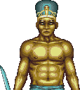
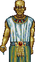
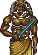
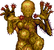
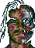

# 蠟像館之謎 — 怪物圖鑑（Bestiary）

> 一份為文化保留而作的怪物誌。Waxworks（1992, Horrorsoft）以它毫不留情的血腥與「花式死法」聞名——每一種怪物都有專屬的、把你開膛破肚的方式。這裡把它們一一記下，連同該怎麼反殺。
>
> 資料來源：遊戲 item 資料（`objectFlags==kOFText` 判定為生物）＋ 攻略戰鬥細節 ＋ 場景設定。譯名沿用專案 [`glossary.md`](../translations/glossary.md)。sprite 為識別／保存用途之合理引用。

## 戰鬥通則（先讀，不然你會死很多次）

Waxworks 的戰鬥是**即時**、可**瞄準敵人特定身體部位**的。這不是裝飾——它是活命的關鍵：

- **先廢四肢，再取要害**：對殭屍、守衛這類敵人，先砍斷持武器的手臂讓牠無害，再從容斬首／刺心。硬拚要害往往先被牠砍死。
- **每一擊都有落點**：瞄頭、瞄手、瞄軀幹的結果完全不同。試不同部位。
- **武器有限**：礦坑的化學噴槍只能用 12 次，倫敦的劍杖要抓破綻，別亂揮。
- **死了就是死了**：Waxworks 會給你一張**屍體特寫**當墓誌銘。存檔，常存檔。

---

## 一、古埃及金字塔　The Pyramid

阿努比斯的國度。木乃伊、祭司、守衛，全在黑暗的墓道裡等著把闖入聖域的你獻祭。

### 守衛　A Guard

法老陵墓的持械守衛，是金字塔裡最常見的敵人（遊戲內布署了十餘個）。手持長矛或短劍，成群站崗。
- **打法**：先瞄**持武器的手臂**打掉牠的攻擊力，再攻頭部。正面對砍容易吃虧。
- **年代註**：這些守衛的 AI 極其單純，但當年 386 上的即時戰鬥＋血腥演出，已經足夠讓半夜偷玩的小孩心臟狂跳。

### 祭司　A Priest

阿努比斯的侍僧，比守衛更棘手，散佈在金字塔深處的儀式廳。
- **打法**：同樣先廢手再取要害；祭司常成組出現，注意別被包夾。

### 阿努比斯大祭司　The High Priest of Anubis　【BOSS】

埃及場的最終魔頭，被詛咒的邪惡祖先之一，胡狼神阿努比斯在人間的代言人。
- **打法**：先解開場景謎題（平衡天平砝碼、以聖甲蟲護身符開石棺），削弱牠的守護；正面戰以**長矛連續戳刺**壓制。
- **lore**：牠守著你祖先的罪，也守著回家的路。放倒牠，公主才能得救。

### 木乃伊　The Mummy
裹屍布下的乾屍，緩慢但難纏，繃帶纏繞、雙臂前伸的經典造型——1990 年代恐怖遊戲的標配惡夢。

---

## 二、變種植物礦坑　The Mine

一座被邪教與變異吞噬的礦坑。空氣是毒的，牆會抓人，而最深處盤著一頭不該存在的東西。

### 變種怪　A Mutant

礦坑裡最多的敵人（布署了近二十個），曾是礦工與村民，被「邪魔」的力量扭曲成半人半植物的怪物。
- **打法**：主武器是**限用 12 次**的化學噴槍——省著用，別對雜兵浪費。近身時鐵棒也行。
- **氛圍**：毒氣瀰漫的坑道裡，牠們從陰影中拖著變形的身體逼近，是全遊戲最幽閉恐怖的一段。

### 邪魔　The Evil One　【BOSS】
礦坑深處的巨型植物怪，坐在腐屍堆成的黏液池中，由變種奴隸餵養。被詛咒祖先的化身。
- **打法**：先用**鐵棒戳瞎牠的眼睛**，再與爆破工合作**鑽孔埋炸藥**引爆；或以火攻（約需 800 點傷害）。引爆後有限時逃脫。
- **名場面**：整個 boss 戰是「解謎＋戰鬥」的合體，當年不看攻略幾乎必卡。

---

## 三、墓園・外西凡尼亞　The Graveyard

月光、濃霧、成排的墓碑，和從土裡爬出來的東西。這一場是對經典吸血鬼傳說的致敬。

### 殭屍　A Zombie

從墳裡爬出的活死人，成群湧來（布署約十個）。Waxworks 的殭屍不是砍頭就死——
- **打法**：**砍頭沒用**，必須**先打斷四肢**讓牠無法動作，再斬首才能真正解決。這個「分部位擊破」的設計，在 1992 年相當前衛。
- **死法警告**：被殭屍群包圍而不先廢肢，你會被活活撕開。

### 弗拉迪米爾　Vladimir　【BOSS】
> （sprite 待補——素材已定位於棺材場景 VGA zone，下一版補上。）

墓園場的最終魔頭，死靈法師兼吸血鬼，被詛咒祖先的又一副面孔，住在月光下的教堂裡。
- **打法**：對付牠的爪牙用**削尖的木樁**刺穿；最終決戰要**卸下武器、徒手**與弗拉迪米爾搏鬥（用武器反而不行）。過程需先備妥少女之心與麵包等解咒材料、聽鮑里斯叔叔的咒語提示。
- **lore**：木樁、棺材、月光教堂——這一場把德古拉的整套符號玩了一遍。

---

## 四、維多利亞倫敦・白教堂　Whitechapel

沒有超自然怪物，只有一個真實得多的惡夢：一個在霧裡開膛破肚的男人。

### 開膛手傑克　Jack the Ripper　【BOSS】

史上最惡名昭彰的連續殺人魔，白教堂場的最終對決。而諷刺的是——街坊都以為**兇手是你**。
- **打法**：貼身刀戰，抓到**破綻後持續猛攻不停手**，以紳士**劍杖（sword cane）**了結；瞄準逼退後將屍身推落泰晤士河。
- **前置**：得先用鉛筆拓出日記隱形字、偽裝紳士混進黑公牛酒館、一步步逼近真兇。
- **文化註**：把玩家放進「被誤認為開膛手」的處境，是本場最陰狠的敘事設計。

### 看門惡犬　The Guard Dog
白教堂某密室的看門狗，擋住你的去路。
- **打法**：不必硬拚——**用安眠藥拌內臟**餵牠，迷昏了事。這種「智取而非強攻」的謎題，正是老式冒險遊戲的精髓。

---

## 附錄：Waxworks 的「死亡美學」

當年的玩家不會忘記——每次失手，遊戲都給你一段**專屬死亡動畫**：被斬首、被開膛、被藤蔓絞碎、被木乃伊掐死。這種毫不遮掩的血腥，讓 Waxworks 在 1992 年就被貼上「十八禁」的標籤（巴哈玩家 tsuchung 語）。它不是為了噁心而噁心——那份「你隨時可能死得很難看」的壓迫感，正是這款遊戲三十年後仍讓人記得的原因。

> 譯名與資料如有疏漏，歡迎回報。這份圖鑑獻給所有當年在沒有中文、沒有攻略的深夜裡，被這些怪物殺了一次又一次、卻捨不得關機的玩家。
